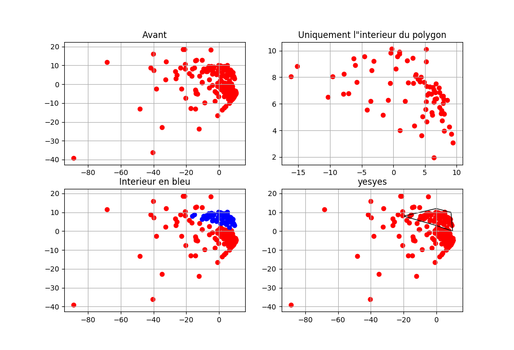
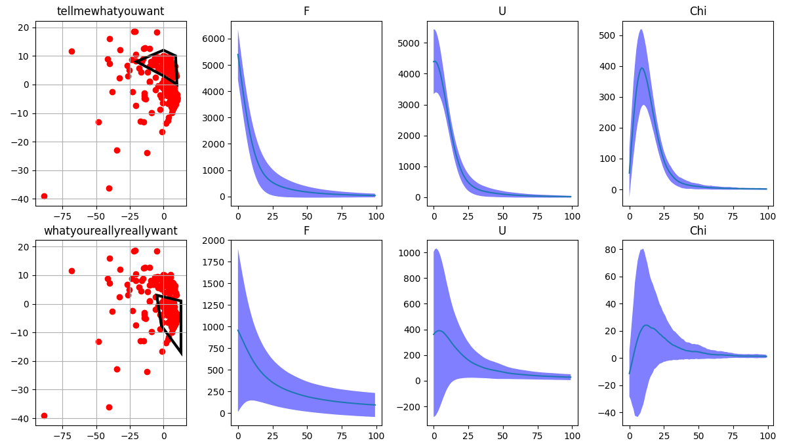
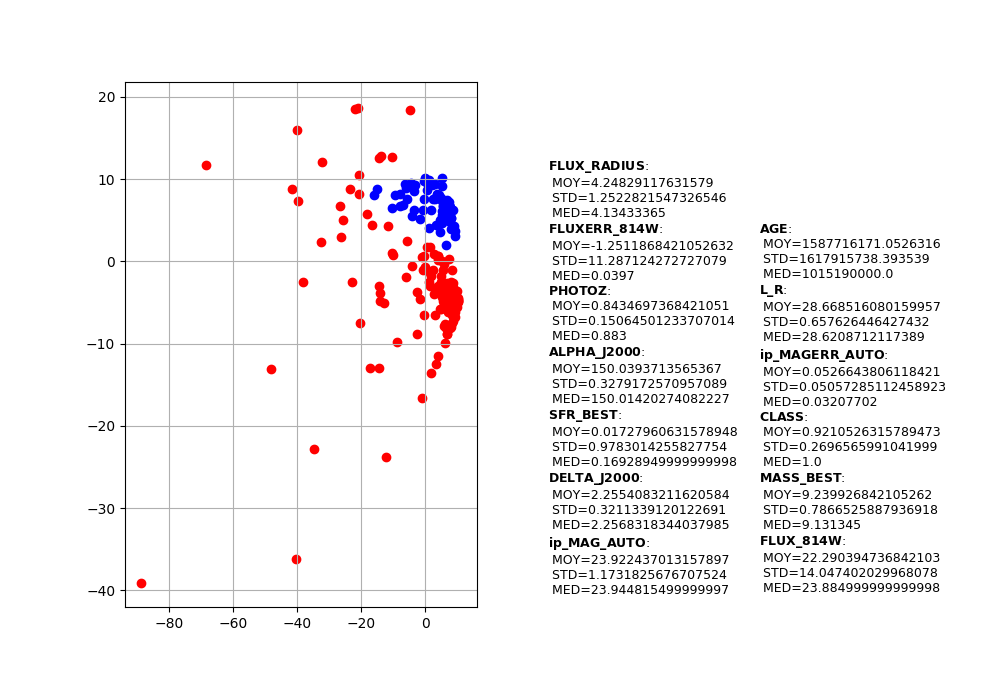
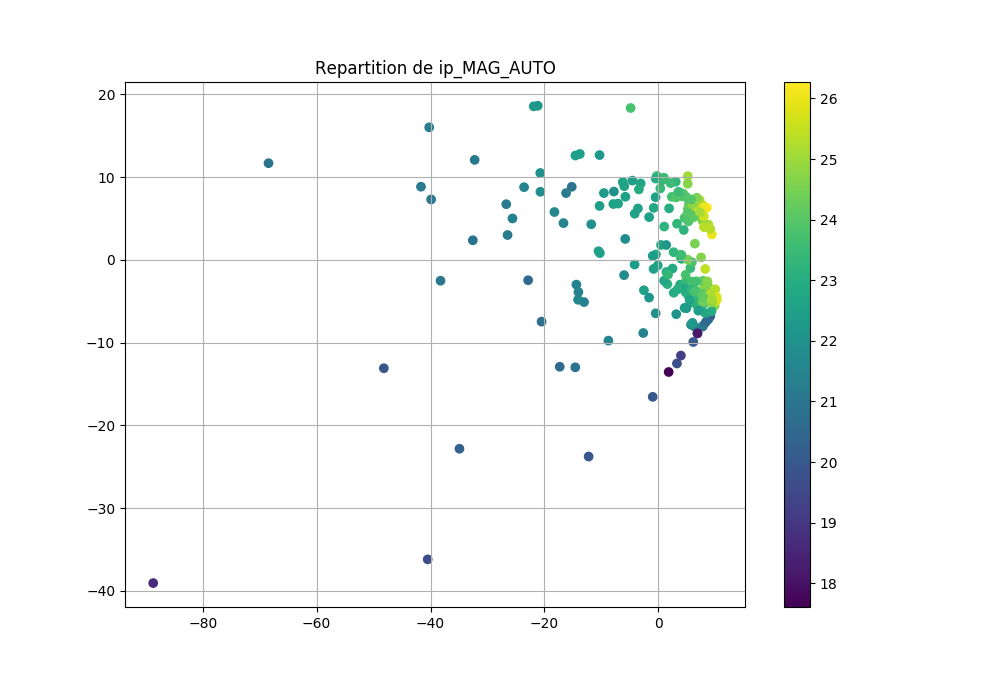

# Projet-Galaxie-2020

Rapport de projet : [ICI](./Projet_Galaxies_fin.pdf)

Présentation: [ICI](Presentation_galaxies___.pdf)

## Arborescence

| Fichier | Contenu | Type |
| :-----: | :-----: | :-----: |
|   |   |   | 
| pic_process.py | Toutes les fonctions de traitement d'images, bruits | Pack de fonctions |
| minkos.py | Toutes les fonctions relatives aux fonctionelles de M | Pack de fonctions |
| matrices.py | Fonctions de calculs sur les matrices / PCA | Pack de fonctions |
|   |   |   | 
| main.py | Calcule les fonctionelles d'une image en format DAT ou FITS | Programme |
| trasismooth.py | Représente les variations des fonctionelles en fonction du lissage des images | Programme |
| morpho.py | Utilise la méthode conventionelle pour calculer les paramètres d'une galaxie | Programme |
| transismoothall.py | Variations des fonctionelles en fonction du lissage séparées en quatre fenêtres | Programme |
| every.py | Compare toutes les fonctionelles de chaque image présente dans un répertoire | Programme |
| create_matrice.py | Calcule complètement la matrice des fonctionelles et rend les valeurs propres qu'on recherche | Programme |
|   |   |   | 
| test_binary.py | Enregistre les images binaires correspondantes aux maxima/minima locaux | Test |
| test_crop.py | Crop une fonctionelle en l'arretant lorsqu'elle converge vers 0 | Test |
| test_binary_interactive.py | Montre les images binarisées en fonction de l'input, s'actualise en temps réel | Test |
| example_polygon.py | Sélectionne les points dans un Polygon | Test |
| example_shrunk_data.py | Sélectionne et représente les fonctionelles de deux groupes interressants | Test |

| **Attention: Les fichiers de type "Pack de fonctions" sont utilisés par plusieurs programmes, faire attention lors de leurs modifications.** |
| --- |

## main.py

### Appel:
  `python main.py [FITS ou DAT file] [optional args]`

  - Le chemin vers l'image peut être absolu ou relatif.
  - Les arguments optionels et leurs utilisations peuvent être vus avec `python main.py --h`

### Exemple de résultat:
  ![alt text][Test1]

  [Tous les résultats](osef/all_res.md)

## transismooth.py
  `python transismooth.py [FITS ou DAT file] [optional args]`

  - `-smooth [NOMBRE]` pour le nombre d'itérations. Attention, à plus de 6, le temps de calcul est très long.

### Exemple de résultat:

## morpho.py
  `python morpho.py [FITS ou DAT file] [optional args]`

## every.py

### Exemple de résultat:

## test_binary.py
  `python test_binary.py [FITS ou DAT file] [optional args]` 

### Exemple de résultat:

 
[Test1]: img/yesyes.png "SuperLesFonctionelles"

## test_binary_interactive.py

  - Possibilité de cliquer sur la courbe pour affichier l'image binarisée correspondante.

## create_matrice.py

  - Il faut donner en argument le dossier où sont les images en format DAT, et le dossier où sont les résultats de la méthode conventionelle.
  - La première fois, il faut ne pas utiliser l'argument `-n` pour traiter les images et les renommer en enlevant les strings "-", "\xd1", "+", qui posent problème.

  - Ou alors vous pouvez directement utiliser le fichier "out.npy" déjà calculé avec l'argument `-l`, pour `--load`.

## degrade.py

Exemple de résultat :

## example_polygon.py

## example_shrunk_data.py

## example_plot_infos.py

## example_plot_gradient.py

## example_plot_all_gradient.

[Tous les résultats](osef/grad.md)